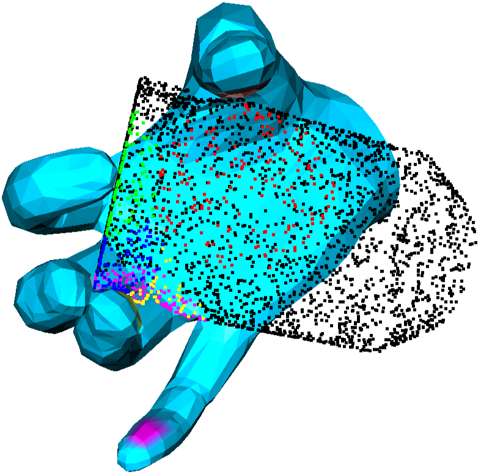
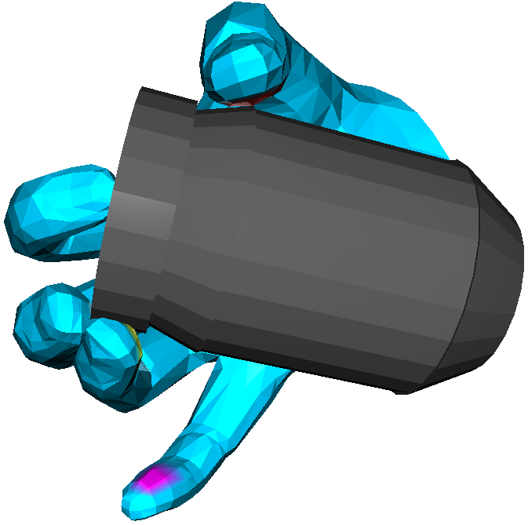
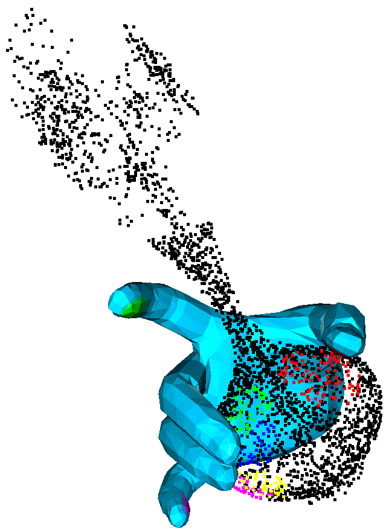
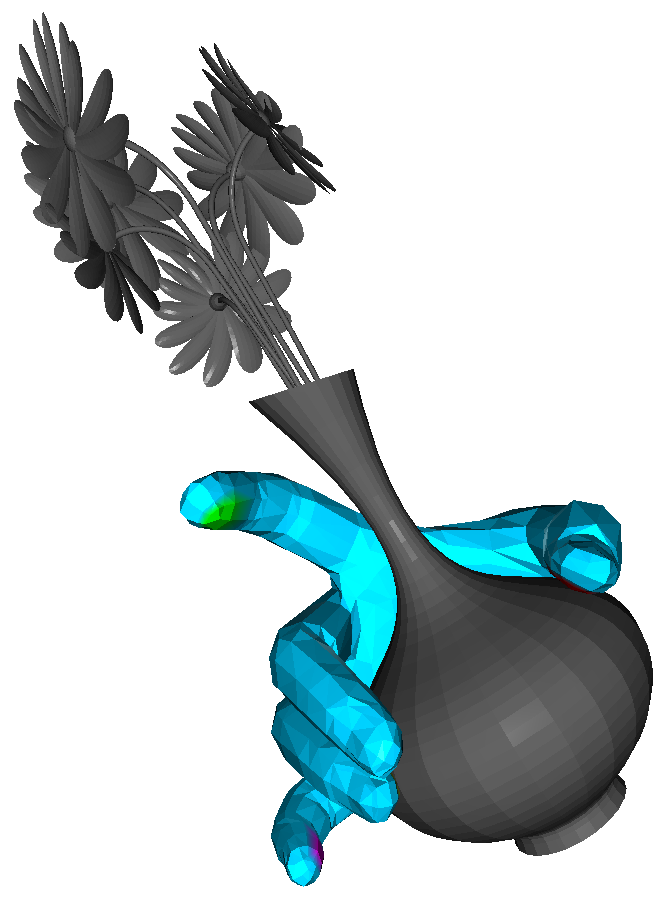

# GrainGrasp
### GrainGrasp: Dexterous Grasp Generation with Fine-grained Contact Guidance

## Requirements:
The ```Python``` version for this project is ```3.9.18```.  
These packages we used:
```
numpy==1.23.0
pytorch==2.0.1+cu118
open3d==0.17.0
trimesh==4.1.7
attrdict==2.0.1
```

```mano```:  The version of ```MANO``` slightly different from [the one provided by Omid Taheri](https://github.com/otaheri/MANO), please use the version we provide. You should download the MANO model files from [MANO](http://mano.is.tue.mpg.de/) website. Then put ```MANO_RIGHT.pkl``` into ```mano/models/``` in this project directory. This path is also customized in [here](config.json#6).

```pytorch3d```: The installation of pytorch3d can be found in [pytorch3d](https://github.com/facebookresearch/pytorch3d).

## Run Example
```Python
python run_complete.py -i=3 -s=1234
```
Maybe you will see the following results:




```Python
python run_only_opt.py -i=2 -s=134
```
Maybe you will see the following results:



**Note: due to the randomness, different results may be generated. The images are for reference only.**


## Training Code
If you intend to retrain the model, please download the [obman dataset](https://www.di.ens.fr/willow/research/obman/data/) and [ShapeNetCore.v2](https://shapenet.org/), and then set their paths in the code.

Place the ```obman``` directory after decompression and the compressed
```ShapeNetCore.v2.zip``` file in the ```Data``` directory. These paths are also customized in [here](config.json#26).

The data processing part can be found in [dataprocess.py](dataprocess.py). We recommend incorporating the point cloud sampling steps into the training process rather than setting them before training, better training methods will generate better results.

## More
The configurations for the experiments can be found and modified in [config.json](config.json).


